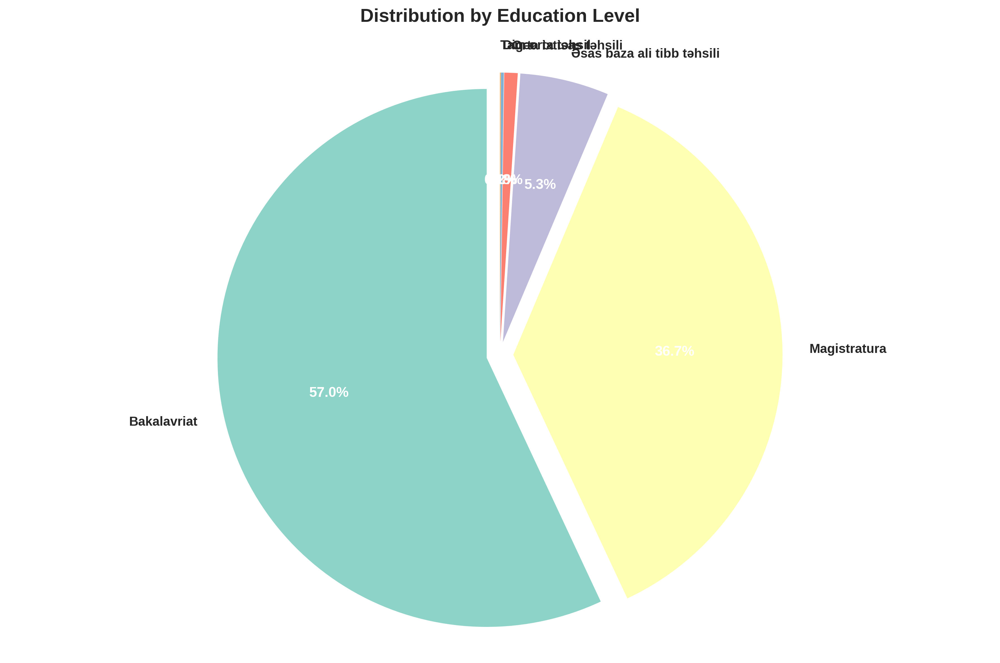
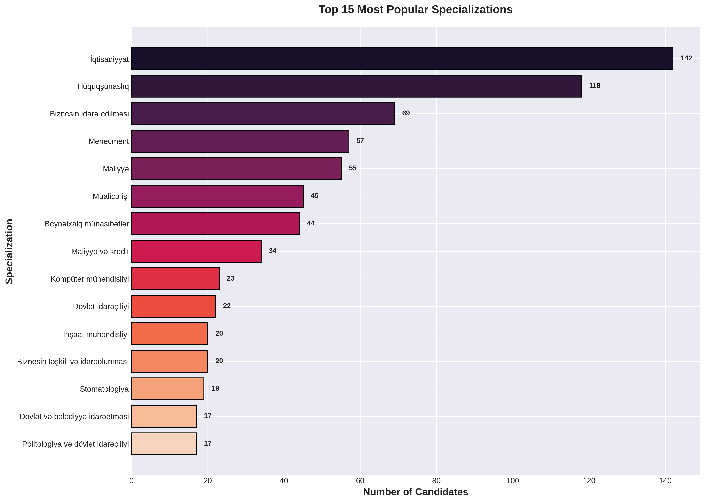
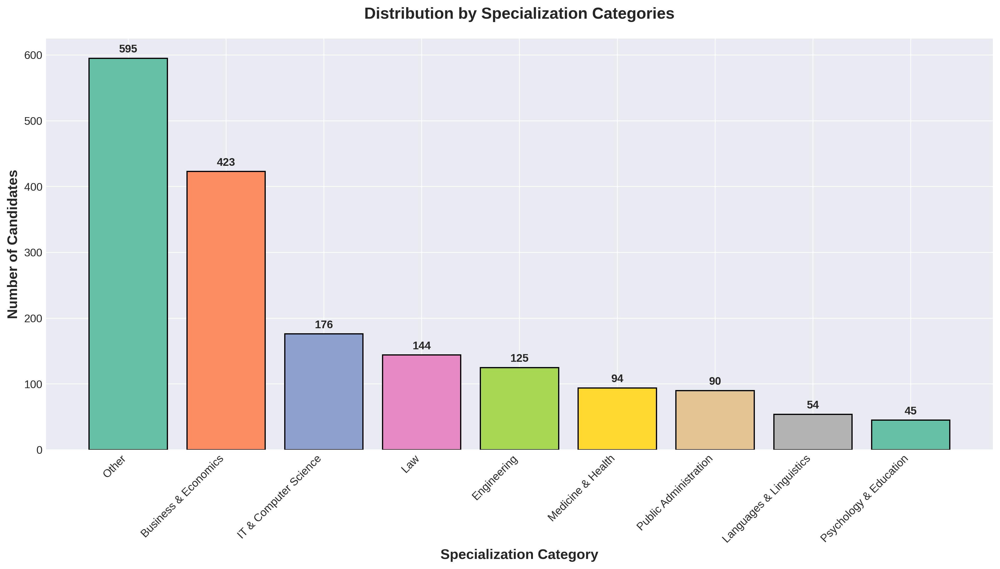
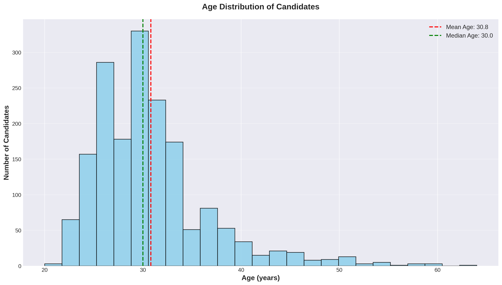
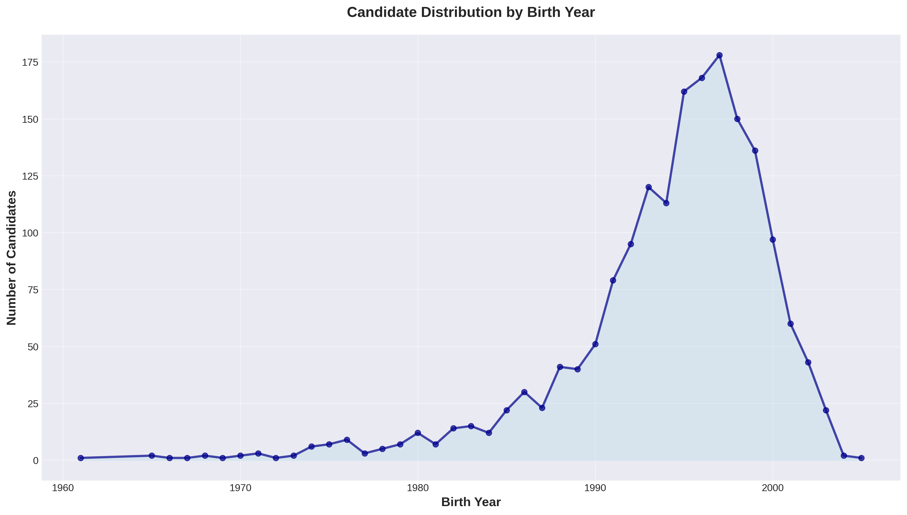
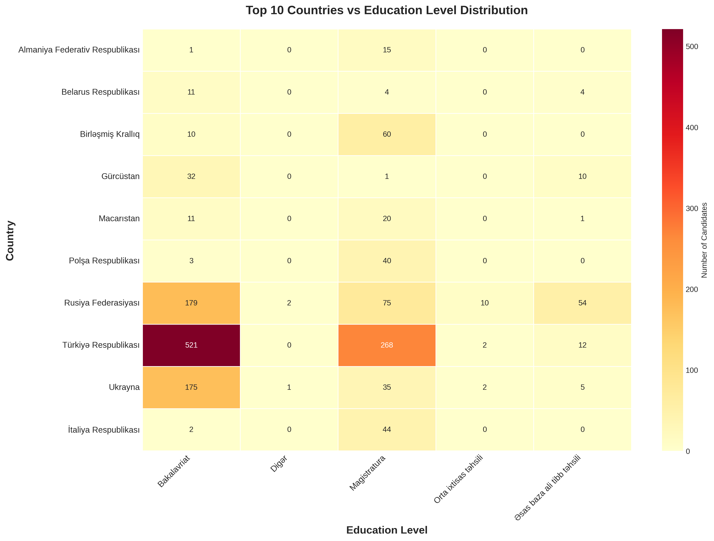

# KADR ENIC Candidates Data Analysis 📊

## Executive Summary

This comprehensive analysis examines **1,746 valid candidate records** from the KADR ENIC database, representing international candidates seeking education credential recognition across **44 countries** and **605 universities** with **406 different specializations**.

---

## 📈 Key Insights

### Geographic Distribution

**Key Findings:**
- **Turkey dominates** with 803 candidates (46.0%) - nearly half of all candidates
- **Russia** ranks second with 321 candidates (18.4%)
- **Ukraine** accounts for 218 candidates (12.5%)
- Top 3 countries represent **76.9%** of all candidates
- The remaining 41 countries share only 23.1% of candidates

**Actionable Insights:**
✅ **Priority Focus**: Establish dedicated support channels for Turkish-language candidates
✅ **Resource Allocation**: Create country-specific documentation for Turkey, Russia, and Ukraine
✅ **Partnership Opportunities**: Develop relationships with top universities in these three countries
✅ **Language Support**: Ensure translation services for Russian, Ukrainian, and Turkish languages

---

### Education Level Analysis

**Key Findings:**
- **Bachelor's degrees (Bakalavriat)** dominate at 56.9% (994 candidates)
- **Master's degrees (Magistratura)** account for 36.7% (640 candidates)
- **Medical education** represents 5.3% (93 candidates)
- Technical and secondary education combined: less than 1%

**Actionable Insights:**
✅ **Verification Priority**: Streamline bachelor's and master's degree verification processes
✅ **Medical Credentials**: Create specialized verification protocol for medical degrees
✅ **Process Optimization**: Fast-track processing for the 93.6% bachelor's/master's degree applicants
✅ **Quality Control**: Implement enhanced verification for the small percentage of non-standard credentials

---

### Specialization Trends

**Key Findings:**
- **Economics** leads with 142 candidates (8.1%)
- **Law** follows with 118 candidates (6.8%)
- **Business Management** attracts 69 candidates (4.0%)
- **Management** and **Finance** round out the top 5
- High specialization diversity (406 different fields)

**Actionable Insights:**
✅ **Expert Panel**: Recruit specialized evaluators for Economics, Law, and Business fields
✅ **Curriculum Mapping**: Develop comprehensive equivalency frameworks for top 15 specializations
✅ **Industry Partnerships**: Connect with professional associations in dominant fields
✅ **Career Guidance**: Provide field-specific employment market insights for top specializations

---

### Specialization Categories

**Key Findings:**
- **Business & Economics** dominates with 500+ candidates
- **Engineering** and **Medicine & Health** are strongly represented
- **IT & Computer Science** shows significant presence
- Diverse portfolio across 9 major categories

**Actionable Insights:**
✅ **Sector Focus**: Create specialized evaluation teams by category
✅ **Standards Development**: Establish category-specific quality benchmarks
✅ **Technology Integration**: Implement automated checks for Business/Economics credentials (highest volume)
✅ **Growth Opportunity**: Position services for emerging IT sector demands

---

### Age Demographics

**Key Findings:**
- **Mean Age**: 30.8 years
- **Median Age**: 30.0 years
- **Age Range**: 20-64 years
- **Peak concentration**: 22-35 years (early to mid-career professionals)
- Strong representation of recent graduates and career-changers

**Actionable Insights:**
✅ **Digital First**: Young demographic demands mobile-friendly, digital-native application process
✅ **Career Services**: Provide employment integration support for 20-35 age group
✅ **Communication Strategy**: Use modern communication channels (social media, instant messaging)
✅ **Speed Priority**: Young professionals value quick turnaround times - optimize for speed
✅ **Experience Level**: Tailor services for entry-level to mid-career professionals

---

### Top Universities

**Key Findings:**
- **High fragmentation**: Top university only represents ~20 candidates
- **605 different universities** represented
- Turkish and Russian universities dominate top positions
- Wide international university coverage

**Actionable Insights:**
✅ **University Database**: Build comprehensive equivalency database for top 100 universities
✅ **Quality Tiers**: Establish university reputation/ranking-based verification protocols
✅ **Direct Partnerships**: Create verification agreements with top 50 universities
✅ **Automation Opportunity**: Pre-verify credentials from frequently appearing institutions
✅ **Risk Assessment**: Implement enhanced scrutiny for lesser-known institutions

---

### Birth Year Trends

**Key Findings:**
- **Peak birth years**: 1990-2000 (millennials and early Gen Z)
- Increasing trend toward younger candidates
- Strong representation from 1985-2005 birth cohort
- Recent surge in younger applicants (born after 2000)

**Actionable Insights:**
✅ **Future Planning**: Expect continued growth from Gen Z candidates (born 2000+)
✅ **Service Evolution**: Adapt to expectations of digital-native generation
✅ **Long-term Strategy**: Build scalable systems for increasing application volumes
✅ **Retention**: Young candidates may apply multiple times (bachelor's then master's)

---

### Country vs Education Level Matrix

**Key Findings:**
- **Turkey**: Strong in both bachelor's (500+) and master's (250+) degrees
- **Russia**: Balanced distribution across education levels
- **Ukraine**: Predominantly bachelor's degrees
- **UK**: Focused on master's degrees (premium market)
- Clear country-specific education patterns

**Actionable Insights:**
✅ **Market Segmentation**: Create country-specific marketing strategies
✅ **UK Premium Services**: Offer expedited/premium services for UK master's candidates
✅ **Turkey Bachelor's Pipeline**: Streamline high-volume bachelor's processing for Turkish universities
✅ **Russia Comprehensive**: Provide full-spectrum services for diverse Russian education system
✅ **Targeted Communication**: Customize messaging by country and education level

---

## 🎯 Strategic Recommendations

### 1. **Operational Efficiency**
- **Automate Top 3 Countries**: Build specialized automated processing for Turkey, Russia, Ukraine credentials
- **Template Library**: Create pre-vetted evaluation templates for top 50 universities
- **Fast Track**: Implement express lane for standard bachelor's/master's from recognized institutions
- **Batch Processing**: Group similar applications by country/university for efficiency

### 2. **Market Expansion**
- **Language Localization**: Full Turkish, Russian, and Ukrainian language support
- **Digital Marketing**: Target 25-35 age group via social media and digital channels
- **University Partnerships**: Direct integration with top 20 universities for real-time verification
- **Career Services**: Add employment integration services (highly valuable to young professionals)

### 3. **Quality Assurance**
- **Risk-Based Approach**: Enhanced verification for non-top-15 specializations
- **Medical Standards**: Specialized protocols for 5.3% medical credentials (critical field)
- **Fraud Detection**: Focus on universities appearing <3 times in database
- **Continuous Monitoring**: Regular updates to university and specialization equivalency databases

### 4. **Customer Experience**
- **Application Status Tracking**: Real-time updates (expected by digital-native users)
- **Mobile Optimization**: Responsive design for 20-35 age demographic
- **Multilingual Support**: Priority for Turkish, Russian, English, Ukrainian
- **Speed Commitment**: Guaranteed turnaround times for standard applications
- **Transparency**: Clear equivalency explanations and appeals process

### 5. **Technology Investment**
- **AI-Powered Screening**: Automated initial review for top country/university combinations
- **Blockchain Verification**: Partner with universities for tamper-proof credential sharing
- **API Integrations**: Connect with major university credential systems
- **Data Analytics**: Predictive modeling for fraud detection and processing time estimation

### 6. **Revenue Opportunities**
- **Premium Services**: Fast-track processing for UK and Western European credentials
- **Bulk Corporate**: Package deals for recruitment agencies and employers
- **University Partnerships**: Subscription model for frequent partner institutions
- **Advisory Services**: Consultation for students planning foreign education

---

## 📊 Data Quality Notes

- **Total Records**: 1,892
- **Valid Records**: 1,746 (92.3%)
- **Missing Data**: 146 records (7.7%)
- **Data Quality**: High (92.3% completion rate)

**Data Completeness:**
✅ All valid records contain: name, country, specialization, education level
✅ Birth dates available for age analysis
✅ University information complete for institutional analysis

---

## 🔍 Methodology

### Data Processing
1. **Data Cleaning**: Removed 146 records with missing critical information
2. **Age Calculation**: Based on birth dates with outlier filtering (18-80 years)
3. **Categorization**: Custom algorithms for specialization grouping
4. **Visualization**: High-resolution charts (300 DPI) for professional reporting

### Statistical Approach
- **Descriptive Statistics**: Mean, median, distribution analysis
- **Cross-Tabulation**: Multi-dimensional analysis (country × education level)
- **Trend Analysis**: Temporal patterns in birth year data
- **Segmentation**: Category-based grouping for actionable insights

---

## 📁 Chart Files

| Chart | Filename | Description |
|-------|----------|-------------|
| **Chart 1** | `01_distribution_by_country.png` | Top 15 countries by candidate volume |
| **Chart 2** | `02_distribution_by_education_level.png` | Education level breakdown (pie chart) |
| **Chart 3** | `03_top_specializations.png` | Top 15 most popular specializations |
| **Chart 4** | `04_age_distribution.png` | Age demographics with mean/median |
| **Chart 5** | `05_top_universities.png` | Top 15 universities by candidate count |
| **Chart 6** | `06_birth_year_trends.png` | Temporal distribution of candidates |
| **Chart 7** | `07_country_education_heatmap.png` | Country vs education level matrix |
| **Chart 8** | `08_specialization_categories.png` | Grouped specialization categories |

---

## 📞 Next Steps

### Immediate Actions (0-30 days)
1. ✅ Review and approve strategic recommendations
2. ✅ Prioritize Turkish, Russian, and Ukrainian language support
3. ✅ Establish fast-track process for top specializations
4. ✅ Begin university partnership outreach (top 20)

### Short-term Goals (1-3 months)
1. 📋 Implement automated screening for top 3 countries
2. 📋 Launch mobile-responsive application portal
3. 📋 Create specialized evaluation teams by category
4. 📋 Develop comprehensive university equivalency database

### Long-term Vision (3-12 months)
1. 🎯 Full digital transformation of credential evaluation
2. 🎯 AI-powered fraud detection system
3. 🎯 Blockchain-based verification partnerships
4. 🎯 Regional expansion beyond current 44 countries

---

## 📧 Questions or Feedback?

For questions about this analysis or to discuss implementation of recommendations, please refer to the main project documentation.

**Analysis Generated**: November 22, 2025
**Data Source**: kadr_enic_candidates.csv
**Total Candidates Analyzed**: 1,746
**Countries Represented**: 44
**Universities**: 605
**Specializations**: 406

---

*This analysis provides data-driven insights to optimize operations, improve customer experience, and drive strategic growth for KADR ENIC credential recognition services.*
